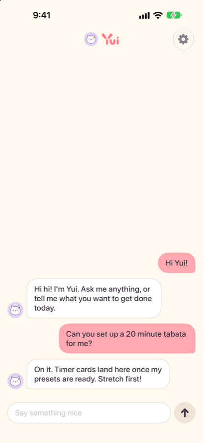

# Yui | iOS app and Hermes plugin

Yui is a phone app for talking to your own AI agents. You chat like normal. When a button, a timer or a table would work better than text, the agent puts one on the screen, and your taps go straight back to it.

Yui brings no brain of its own. You bring the agent, and Yui gives it a face, a voice and a screen it can draw on. Hermes is the first agent it supports.

This repo holds the native SwiftUI app, the Swift Yui Lines parser, the Supabase backend and the Hermes plugin. The roadmap, the progress log and the Yui Lines spec live in the hub repo, [postscarcityai/yuigui](https://github.com/postscarcityai/yuigui), and at [yuigui.com](https://www.yuigui.com).

<p>
  
  
</p>

## What is in here

| Path | What it is |
| --- | --- |
| `Yui/` | The iOS app (SwiftUI, iOS 26, iPhone only) |
| `Packages/YuiLines/` | Swift parser for Yui Lines, no dependencies |
| `project.yml` | XcodeGen project. The `.xcodeproj` is generated, not committed |
| `hermes-plugin/` | The `yui` Hermes platform plugin |
| `adapters/openclaw/` | Yui channel plugin for OpenClaw: an OpenClaw agent talks in Yui like a Hermes agent |
| `adapters/webhook/` | Webhook bridge, Python and Node: any agent that answers an HTTP POST |
| `supabase/functions/yui-mcp/` | Yui MCP server: Claude Code, Cursor or any MCP client puts a screen on your phone and reads the taps back |
| `supabase/functions/yui-oauth/` | OAuth 2.1 for the MCP server: discovery, dynamic client registration, PKCE, approve in the app or with a pairing code, rotating refresh tokens |
| `supabase/` | Migrations, edge functions and live tests for accounts and agents |
| `scripts/` | TestFlight upload, test builds by link and App Store Connect helpers |

## Run the app

You need a Mac with Xcode 26 and [XcodeGen](https://github.com/yonaskolb/XcodeGen) (`brew install xcodegen`).

```sh
export YUI_TEAM_ID=<your Apple team id>   # or leave empty for the simulator
xcodegen generate
open Yui.xcodeproj
```

Pick an iPhone simulator and run. DEBUG builds take a few launch arguments for screenshots and offline work: `-yuiDemoAccount` (skip Sign in with Apple), `-yuiSignedOut`, `-yuiAgents`, `-yuiNoAgents`, `-yuiAddAgent`, `-yuiAddAgentCode`, `-yuiSettingsLarge`, `-yuiConfirmDelete`.

Parser tests:

```sh
cd Packages/YuiLines && swift test
```

The tests use Swift Testing, which needs full Xcode, not just the Command Line Tools. If `swift test` says `no such module 'Testing'`, run `sudo xcode-select -s /Applications/Xcode.app`. One test checks that the bundled conformance vectors match the hub repo. When the hub adds a vector, run `Packages/YuiLines/scripts/sync-vectors.sh` with yuigui checked out next to this repo.

The app points at our Supabase project (`Yui/Sources/Account/YuiBackend.swift`). The key in that file is a public client key. It grants only the anon role, which cannot read any `yui_` table. To run your own backend, create a Supabase project, apply `supabase/migrations/` in order, deploy the functions in `supabase/functions/`, and change the URL and key in that file.

## Connect Hermes

The `yui` plugin makes Yui a Hermes messaging platform, next to Telegram. Each Hermes profile you install it into gets its own thread in the app and keeps one memory across Yui and Telegram. It dials out to Supabase with a scoped connector token, so your machine opens no inbound ports.

1. In the app, go to Agents, tap Add agent, and note the six-digit code.
2. On the machine that runs Hermes:

   ```sh
   hermes-plugin/install.sh <profile>
   hermes -p <profile> yui pair <code>
   hermes -p <profile> gateway restart
   hermes -p <profile> yui status
   ```

3. The agent shows up in the app. Talk to it.

The plugin injects a short guide into each Yui turn so the agent knows it can put Yui Lines on screen (source: `yuigui/spec/CHANNEL.md`, synced by `hermes-plugin/sync_channel.py`). The connector credential lives at `~/.hermes/yui/connector.json`, outside the repo.

Without Hermes loaded, `python3 hermes-plugin/yui/connector.py pair <code> --profile <profile>` does the same pairing. How messages, events and credentials flow: `yuigui/spec/RELAY.md`.

**On OpenClaw?** Install the channel plugin in `adapters/openclaw/` (`openclaw plugins install ./yui/adapters/openclaw`), pair with `openclaw yui pair <code>`, restart the gateway. Your agent gets the channel guide every turn and answers with screens. Test: `python3 adapters/openclaw/tests/openclaw_e2e.py`.

**Not on Hermes?** Any agent that answers an HTTP POST can talk in Yui through the webhook bridge in `adapters/webhook/` (Python stdlib or Node 20, no dependencies): pair it with the same code, point it at your agent's URL, and it delivers every message once, with the channel guide in each request. Ten-line example agents included. Test: `python3 adapters/webhook/tests/webhook_e2e.py`.

**On Claude Code, Cursor or another MCP client?** Add the Yui MCP server: pair with the app's code as kind `mcp` to get a token, then `claude mcp add --transport http yui https://<ref>.supabase.co/functions/v1/yui-mcp --header "Authorization: Bearer yui_ct_..."`. Tools `yui_show`, `yui_answers`, `yui_say`, `yui_threads`; the channel guide is the `yui_guide` prompt. Steps and the contract: [yuigui.com/developers/mcp](https://www.yuigui.com/developers/mcp). On an app that only does OAuth (the Claude and ChatGPT apps' custom connectors)? Paste the same URL with no header: it signs in through `yui-oauth` and you approve it in Yui. Tests: `python3 supabase/tests/mcp_test.py` (OAuth included), a real Claude Code against the simulator: `supabase/tests/mcp_claude_e2e.py --sim <udid>`, and the MCP SDK's own OAuth client against the simulator: `supabase/tests/mcp_oauth_e2e.py --sim <udid>`. The function parses what it is sent with a copy of the YL parser; `python3 supabase/scripts/sync_yl.py` refreshes it.

A live round trip test (type, get a Yui Lines screen, tap, get a timer) runs against a real session and a running gateway: `TEST_RUNNER_YUI_RT=<refresh token> TEST_RUNNER_YUI_USER=<uuid> xcodebuild test -scheme Yui -only-testing:YuiUITests`. Without those it skips. Mint a fresh `yui_sessions` row for every run: yui-auth rotates refresh tokens, and replaying a spent one reads as a leak and signs the account out on every device.

Demo clips for the site and social: `python3 scripts/demo_clips.py [timer chart ...]` plays a scripted reply per preset on the demo account (`YuiUITests/YuiDemoTests`) while the simulator records, then cuts a 9:16 and a 16:9 MP4 with the caption burned in, plus a poster and a `clips.json` manifest, into `yuigui/site/public/demo/clips/`. No network, no real account. A new preset gets a test method there and a caption in the script.

## Backend notes

- Sign in with Apple only. Users never enter Supabase Auth: `yui-auth` verifies Apple's identity token and mints a 15-minute JWT with role `yui_user`, which can reach only `yui_*` rows keyed to that user. `yui-delete` revokes the Apple token and deletes the account. Every `yui_*` table cascades from `yui_users`.
- Agents are managed by the user, never hardcoded. Spec: `yuigui/spec/AGENTS.md`. `yui-agents` serves the app, `yui-connect` serves the host (pair, add, heartbeat).
- Relay (`supabase/migrations/20260924010000_yui_relay.sql`): the host trades its connector token at `yui-connect` for a 60-minute `yui_connector` JWT that can read and answer only the threads of agents bound to that host. Tests: `python3 supabase/tests/relay_test.py`.
- Push (`supabase/migrations/20260924020000_yui_push.sql`, function `yui-push`): the app registers its APNs token at sign-in; a host asks `yui-push` to notify after it writes into a thread, and the tap opens `yui://agent/<id>/thread`. Secrets `YUI_APNS_P8`, `YUI_APNS_KEY_ID`, `YUI_APNS_TOPIC`. Tests: `python3 supabase/tests/push_test.py`.
- Reactions (`supabase/migrations/20260924080000_yui_reactions.sql`, spec `yuigui/spec/REACTIONS.md`): hold an agent's message and react with one of six emoji. The app sends one event row; a trigger copies the emoji onto the reacted row (`yui_messages.reaction`), only the six, only on your own agent's messages. Tests: `python3 supabase/tests/reactions_test.py`; end to end with a real model: `supabase/tests/reactions_e2e.py [--sim <udid>]`.
- Mentions (`supabase/migrations/20260925030000_yui_mentions.sql`, spec `yuigui/spec/RELAY.md` "Mentions"): type @ to send a message to another of your agents. Triggers do the routing: the agent you're in isn't asked, the other one gets the words with this thread's last lines, its answer is copied back here in its name, and an agent that is asleep, offline or muted says so in one line. Agents @ each other only while answering you, one hop. Tests: `python3 supabase/tests/mention_test.py`; end to end with two real adapters: `supabase/tests/mention_e2e.py [--sim <udid>]`.
- Our project is shared with other apps, so we apply migrations by hand. Never `supabase db push` or `config push` against it.
- Deploy a function: `supabase functions deploy <name> --project-ref <ref> --use-api --no-verify-jwt`. Secrets (`YUI_JWT_SECRET`, `YUI_SIWA_*`, `YUI_APNS_*`, `YUI_APPLE_TEAM_ID`) are edge function secrets and never live in the repo.
- Tests run live against a real project: `python3 supabase/tests/accounts_test.py` (RLS, cross-user isolation, create and delete) and `python3 supabase/tests/agents_test.py` (registry). Run both after any change to a migration or function. `python3 supabase/tests/strangers_test.py` runs two unrelated throwaway accounts against each other and against every limit below.

## Limits

Yui shares its database with other apps, so a stranger must not be able to hurt the backend, other people, or anything outside `yui_*`. Migration `supabase/migrations/20260924070000_yui_limits.sql` enforces this in Postgres, where every write passes (the app's and the host's direct writes as well as the edge functions). The numbers live in the server table `yui_limits`, readable by any Yui token, and can be tuned there without a release.

Rates are token buckets: `burst` requests at once, refilled at `per minute`. A phone that was offline or a Mac that slept comes back to a full bucket, so its outbox flush lands in one go; only a sustained flood is refused. A refused write gets `429 rate_limited` and costs nothing, and both outboxes (app and plugin) retry 429 with backoff, so nothing is lost. A resend of a row that already landed gets its usual `409`, never a 429.

| What | Limit | Refused with |
|---|---|---|
| Messages and taps, per account | burst 120, then 30 per minute | 429 `rate_limited` |
| Agent replies, per host | burst 240, then 60 per minute | 429 `rate_limited` |
| `yui-connect` calls (heartbeat, session, add), per host | burst 30, then 6 per minute | 429 `rate_limited` |
| Push notifications (`yui-push` notify), per host | burst 60, then 10 per minute | 429 `rate_limited` |
| MCP calls (`yui-mcp`), per MCP connection | burst 60, then 30 per minute | 429 |
| OAuth calls (`yui-oauth` register, authorize, token), per address or client | burst 30, then 10 per minute | 429 `slow_down` |
| `yui-agents` calls, per account | burst 60, then 30 per minute | 429 `rate_limited` |
| Pairing codes, per account | burst 20, then about 20 an hour | 429 `rate_limited` |
| Wrong pairing codes, per client address | 10 per 10 minutes | 429 `too_many_attempts` |
| Message body | 1 to 32,000 characters | 400 (check constraint) |
| Message metadata (`meta`) | 16 KB | 400 (check constraint) |
| Agent look (`theme`) | 2 KB | 400 (check constraint) |
| Photo or video | 50 MB, images and mp4/mov only | 400 (bucket rule) |
| Pictures per day, per account | 200 from the person, 200 from agents | 400 (storage policy) |
| Agents per account | 50 | 403 `limit_reached` |
| Paired hosts per account (not removed) | 10 | 403 `limit_reached` |
| Phones registered for push, per account | 10 | 403 `limit_reached` |
| Live agent-management tokens, per account | 10 | 403 `limit_reached` |
| Message retention | 90 days, then deleted by the daily sweep | |

**Kill switch.** `yui_users.suspended_at` stops one account, `yui_connectors.suspended_at` stops one host. It takes effect on the next request, including tokens minted before: a suspended account cannot send, upload, manage agents, refresh its session or connect a host (`403 account_suspended` / `403 suspended`); a suspended host cannot read, write, upload, connect or push. Nothing is deleted and sessions survive, so restoring brings everything back. Operate it with `python3 supabase/scripts/kill_switch.py status | suspend user|connector <id> --reason "..." | restore user|connector <id>`. A suspended account can still delete itself.

**Retention.** `public.yui_retention()` deletes messages older than 90 days, plus expired pairing codes and sessions, old pairing attempts and idle rate buckets. The daily sweep (`supabase/scripts/media_sweep.py --delete`) runs it first, then removes pictures no remaining message uses.

**Isolation.** `yui_user` and `yui_connector` hold no privilege on any table outside `yui_*` (plus the `yui-media` bucket in Storage), can run no non-Yui security-definer function, and no non-Yui policy applies to them. PROOF Auth keeps signups disabled; Yui accounts never enter it. `strangers_test.py` proves all of this on every run.

## Invites

The beta is by invite as well as by the public TestFlight link. A person asks on yuigui.com (first and last name, the email on their Apple ID, phone), and the request lands in `yui_invites` as `requested`. Nothing goes out until it is approved:

```
python3 supabase/scripts/invite.py list --status requested
python3 supabase/scripts/invite.py approve <id|email> [--template client-default]
python3 supabase/scripts/invite.py add --email E --first F --last L [--phone P]   # invite someone directly
```

`approve` makes a one-time code (only its SHA-256 is stored) and adds the person as a tester to the external TestFlight group "Invited" through the App Store Connect API. Apple sends the TestFlight email itself, so Yui sends no email of its own. Their first Sign in with Apple claims the invite by that email. Hide My Email hands Yui a relay address that matches nothing, so the invite also has a link, `https://www.yuigui.com/i/<code>`, which opens the app (a universal link), and the same code can be typed on the sign-in screen under Invite code. Wrong codes are rate limited. A claimed invite is deleted with the account; a declined one is deleted 30 days later by the daily sweep. `scripts/testflight_public.py` puts every new build in both Public and Invited. Tests: `supabase/tests/invites_test.py` (server) and `supabase/tests/invite_claim_e2e.py --sim <udid>` (the app).

## Test builds

Skip TestFlight when you only want to try main on your own phone. `scripts/devbuild.sh` archives a clean worktree of `origin/main` as an ad hoc build (build number `<commit count>.<n>`, so it never collides with a TestFlight number), puts the `.ipa` and its install manifest in a private Storage bucket behind 7-day signed links, and sends a card with an Install button into your Yui thread. Tap it on the phone: Safari opens yuigui.com/install.html, tap Install there and iOS installs the build over the one you have; your sign-in and threads stay. Pushes keep working: ad hoc builds use the same production APNs as TestFlight.

```sh
scripts/devbuild.sh --force      # build now and send the card
scripts/devbuild.sh              # only if main has app changes and the last link is 3 hours old
scripts/devbuild.sh --no-send    # build and host, print the link, send nothing
```

- Ad hoc builds install only on iPhones registered to your Apple developer account, so a forwarded link installs nowhere else. Register the phone once in the developer portal; `-allowProvisioningUpdates` puts it in the profile on the next build.
- No upload to Apple, so no daily upload limit.
- The card's button is a Yui Lines `card` with `url=`: it shows an arrow, opens Safari and sends nothing to the chat. An app from before that button existed only posts Install: open the `page` link from the script's output (`yuigui.com/install.html#...`) in Safari instead. The link rides in the URL fragment, which never reaches the server.
- The bucket (`yui-builds`, migration `20260924100000_yui_builds.sql`) has no policies: only the service role reads or writes it. `supabase/scripts/media_sweep.py` removes builds older than 8 days.
- Needs the same App Store Connect key as `testflight.sh`, a Supabase access token, and `hermes` for the send.

## TestFlight

`scripts/testflight.sh` archives and uploads with an App Store Connect API key read from `~/.appstoreconnect/`. Never commit keys.

**App Review demo.** Apple's reviewer taps **Demo code** on the sign-in screen and enters the code from the review notes (App Store Connect only, never in this repo). `yui-auth` grant `review` checks it against the edge secret `YUI_REVIEW_CODE` and opens the one account `YUI_REVIEW_USER`; with either secret unset the grant is off. That account's agent is `hermes-plugin/demo_agent.py`: a scripted agent with canned Yui Lines screens, no model and no tools, on its own connector token (`~/.hermes/yui/demo-connector.json`), kept up by launchd. If the reviewer deletes the account, the next demo sign-in recreates it and the demo agent pairs itself again. Gate: `python3 supabase/tests/review_test.py` (21 checks). The App Privacy answers live in `docs/APP-PRIVACY.md`.

## Contributing

Issues and pull requests are welcome. See [CONTRIBUTING.md](CONTRIBUTING.md) and the [Code of Conduct](CODE_OF_CONDUCT.md). Found a security problem? Please read [SECURITY.md](SECURITY.md) first.

## License

[Apache-2.0](LICENSE). Copyright 2026 PostScarcity AI.
